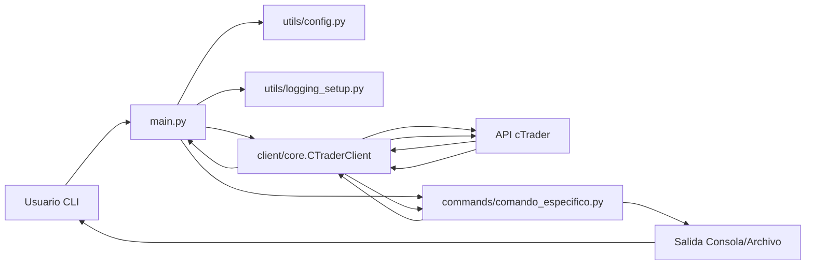

# Cliente API cTrader con OpenApiPy

Este proyecto proporciona un cliente Python para interactuar con la [API Open de cTrader](https://help.ctrader.com/open-api/), permitiendo la autenticación, obtención de datos de mercado (ticks, velas), información de cuentas y gestión de posiciones/órdenes. Utiliza la librería oficial `OpenApiPy` y está diseñado para ejecutarse dentro de un contenedor Docker.

**Recursos de Documentación Clave:**
*   **Documentación Oficial OpenApiPy:** [spotware.github.io/OpenApiPy/](https://spotware.github.io/OpenApiPy/) (Consulta aquí para detalles sobre clases y métodos específicos de la librería)
*   **Código Fuente y Docs Locales:** Explora el directorio `docs/` para el código fuente de `OpenApiPy` y las definiciones de mensajes Proto (`openapi-proto-messages`).
*   **Repositorio Oficial OpenApiPy:** [github.com/spotware/OpenApiPy](https://github.com/spotware/OpenApiPy)
*   **Definiciones Mensajes Proto (Oficial):** [github.com/spotware/openapi-proto-messages](https://github.com/spotware/openapi-proto-messages) (Esencial para entender la estructura de los datos enviados y recibidos)

## Arquitectura Simple (Flujo de Datos CLI)



*(Diagrama simplificado usando sintaxis Mermaid)*

## Características Principales

*   Conexión segura a los endpoints de cTrader (Demo o Live).
*   Autenticación usando credenciales de API.
*   Obtención de datos históricos (velas) y (opcionalmente) ticks.
*   Consulta de información de la cuenta de trading.
*   Consulta de posiciones y órdenes.
*   Manejo asíncrono de la comunicación API usando Twisted.
*   Configuración flexible mediante variables de entorno y argumentos CLI.
*   Diseñado para ejecutarse en un contenedor Docker.

## Requisitos Previos

*   Docker y Docker Compose instalados.
*   Cuenta en cTrader ([Demo](https://ctrader.com/demo-account/) o [Live](https://ctrader.com/live-account/)).
*   Credenciales de API de cTrader:
    *   `Client ID`
    *   `Client Secret`
    *   `Account ID` (el `ctidTraderAccountId` de la cuenta que quieres usar).
    *   Puedes obtenerlas siguiendo la [guía de autenticación de cTrader](https://help.ctrader.com/open-api/authentication).

## Instalación y Ejecución (Docker)

Este cliente está optimizado para ejecutarse como un servicio contenerizado.

1.  **Clonar el Repositorio:**
    ```bash
    git clone <url-del-repositorio>
    cd <nombre-del-repositorio>
    ```

2.  **Configurar Variables de Entorno:**
    *   Copia el archivo de ejemplo: `cp .env.example .env`
    *   Edita el archivo `.env` y rellena tus credenciales de API (`CTRADER_CLIENT_ID`, `CTRADER_CLIENT_SECRET`, `CTRADER_ACCOUNT_ID`).
    *   Puedes ajustar otras variables como `CTRADER_API_HOST` (`live` o `demo`), `LOG_LEVEL`, etc.

3.  **Construir y Ejecutar el Contenedor (Usando Docker Compose):**
    *   Asegúrate de tener un archivo `docker-compose.yaml` similar al descrito en el contexto (adaptando los volúmenes si es necesario).
    *   *Nota: El archivo `.env` es leído automáticamente por Docker Compose en el mismo directorio.*
    ```bash
    # Construir la imagen (si es la primera vez o hay cambios en el Dockerfile)
    docker compose build ctrader-api-conn

    # Iniciar el contenedor en segundo plano
    docker compose up -d ctrader-api-conn
    ```
    *   El contenedor ahora está corriendo y listo para recibir comandos.

## Uso

Los comandos se ejecutan adjuntándose al contenedor en ejecución mediante `docker exec`. El punto de entrada principal es `/app/src/main.py`.

```bash
# Sintaxis general
docker exec -it ctrader-api-conn python /app/src/main.py [opciones] <comando> [argumentos-del-comando]

# Ejemplo: Obtener ayuda
docker exec -it ctrader-api-conn python /app/src/main.py --host demo help

# Ejemplo: Obtener información de la cuenta (usando host 'demo' definido en .env o por defecto)
docker exec -it ctrader-api-conn python /app/src/main.py account_info

# Ejemplo: Obtener velas H1 para el símbolo EURUSD (ID 1) de las últimas 4 semanas
# (Asumiendo que '1' es el ID interno de EURUSD para tu broker)
docker exec -it ctrader-api-conn python /app/src/main.py candles --symbol-id 1 --weeks 4 --period H1

# Ejemplo: Obtener ticks BID del último día para EURUSD (ID 1)
# docker exec -it ctrader-api-conn python /app/src/main.py ticks --symbol-id 1 --days 1 --type BID
```

### Comandos Disponibles y Salida Esperada

*   `help`: Muestra la ayuda y los comandos disponibles.
    *   *Salida esperada: Texto de ayuda generado por argparse.*
*   `account_info`: Obtiene y muestra información de la cuenta de trading.
    *   *Salida esperada (ejemplo):*
        ```
        --- Información de la Cuenta (ID: 1234567) ---
        Balance: 10000.00 EUR
        Equidad: 10050.50 EUR
        Margen Usado: 50.00 EUR
        Margen Libre: 9950.00 EUR
        Nivel de Margen: 20101.00 %
        Broker: Ejemplo Broker Ltd.
        ```
*   `positions`: Obtiene y muestra las posiciones abiertas.
    *   *Salida esperada (ejemplo, si hay posiciones):*
        ```
        --- Posiciones Abiertas (Cuenta: 1234567) ---
        ID        Símbolo   Volumen   Dirección   Precio Entrada   P/L (cuenta)
        --------  --------  --------  ----------  ---------------  --------------
        9876543   EURUSD    10000     BUY         1.08500          +15.20 EUR
        9876544   USDJPY    5000      SELL        145.200          -5.80 EUR
        ```
    *   *Salida esperada (si no hay posiciones):*
        ```
        --- Posiciones Abiertas (Cuenta: 1234567) ---
        No hay posiciones abiertas.
        ```
*   `candles <symbol_id>`: Obtiene velas históricas.
    *   `--period`: Timeframe (ej. `M1`, `H1`, `D1`). Por defecto: `M1`. **Obligatorio.**
    *   `--weeks` / `--days` / `--from` / `--to`: Rango temporal. **Obligatorio especificar uno.**
    *   *Salida esperada (ejemplo):*
        ```
        --- Velas EURUSD (1) H1 (Última Semana) ---
        Timestamp (UTC)        Open     High     Low      Close    Volume
        -------------------  -------- -------- -------- -------- ---------
        2023-10-27 10:00:00   1.05500  1.05600  1.05450  1.05550   12345
        2023-10-27 11:00:00   1.05550  1.05750  1.05500  1.05700   23456
        ... (más velas) ...
        ```
*   `ticks <symbol_id>`: Obtiene ticks históricos. *(Nota: La obtención de ticks puede ser intensiva en datos)*
    *   `--type`: Tipo de tick (`ASK`, `BID`). Por defecto: `BID`. **Obligatorio.**
    *   `--days` / `--from` / `--to`: Rango temporal. **Obligatorio especificar uno.**
    *   *Salida esperada (ejemplo):*
        ```
        --- Ticks BID EURUSD (1) (Último Día) ---
        Timestamp (UTC)        Precio
        -------------------  --------
        2023-10-27 12:00:00.123  1.05701
        2023-10-27 12:00:00.345  1.05700
        ... (más ticks) ...
        ```
*   `list_symbols`: Lista los símbolos disponibles para la cuenta.
    *   *Salida esperada (ejemplo):*
        ```
        --- Símbolos Disponibles (Cuenta: 1234567) ---
         ID   Nombre          Descripción               Categoría
        ----  --------------  ------------------------  -----------
           1  EURUSD          Euro vs US Dollar         Forex
          10  GER30           Germany 30 Index          Indices
          28  XAUUSD          Gold vs US Dollar         Metals
         ... (más símbolos) ...
        ```
*   `history`: Obtiene y muestra el historial de transacciones (deals).
    *   `--days` / `--from` / `--to`: Rango temporal. **Obligatorio especificar uno.**
    *   *Salida esperada (ejemplo):*
        ```
        --- Historial de Deals (Cuenta: 1234567) (Últimos 7 días) ---
        Deal ID    Position ID  Símbolo   Volumen   Dirección   Precio Ejec.   Timestamp (UTC)        P/L Bruto
        ---------  -----------  --------  --------  ----------  -------------  -------------------  -----------
        11223344   9876543      EURUSD    10000     BUY         1.08500        2023-10-26 10:00:00     +20.00 EUR
        11223355   9876543      EURUSD    10000     SELL        1.08700        2023-10-27 14:30:00     -1.50 EUR (Comisión)
        ... (más deals) ...
        ```
*   *(Otros comandos pueden ser añadidos según `PROJECT_SPECIFICATIONS.md`)*

*(Nota: Los `symbol_id` son específicos del broker y pueden obtenerse usando un comando como `list_symbols` o desde la plataforma cTrader).*

## Configuración

La configuración principal se realiza a través del archivo `.env`.

*   **Obligatorias:**
    *   `CTRADER_CLIENT_ID`: Tu Client ID de la API.
    *   `CTRADER_CLIENT_SECRET`: Tu Client Secret de la API.
    *   `CTRADER_ACCOUNT_ID`: El ID numérico de tu cuenta de trading (`ctidTraderAccountId`).
*   **Opcionales:**
    *   `CTRADER_API_HOST`: Host API. Usa `live` para cuenta real o `demo` para cuenta demo (se mapean a `live.ctraderapi.com` y `demo.ctraderapi.com`). Por defecto: `demo`.
    *   `CTRADER_API_PORT`: Puerto API. Por defecto: `5035`.
    *   `LOG_LEVEL`: Nivel de log (ej. `DEBUG`, `INFO`, `WARNING`, `ERROR`). Por defecto: `INFO`.
    *   `OUTPUT_DIR`: Directorio dentro del contenedor para guardar salidas (ej. `/app/data/output`). Por defecto: `/app/data/output`.
    *   `ACCESS_TOKEN`: (Opcional) Si ya tienes un token válido, puedes proporcionarlo aquí para saltar el paso de autenticación inicial.

También se pueden sobrescribir algunas configuraciones mediante argumentos de línea de comandos (ej. `--host`, `--log-level`).

## Estructura del Proyecto

```
.
├── docs/                   # Documentación adicional y de librerías
│   ├── OpenApiPy-main/     # Código fuente y docs de OpenApiPy
│   └── openapi-proto-messages-main/ # Definiciones de mensajes Proto API
├── app/                   # Directorio de trabajo en el contenedor (/app)
│   ├── data/                   # Datos generados (logs, output) - Mapeado como volumen
│   │   ├── logs/
│   │   └── output/
│   └── src/                    # Código fuente de la aplicación - Mapeado como volumen
│       ├── client/             # Lógica de conexión y comunicación API
│       │   ├── __init__.py
│       │   ├── auth.py         # Flujo de autenticación
│       │   └── core.py         # Cliente principal (conexión, envío/recepción)
│       ├── commands/           # Lógica para los diferentes comandos/acciones CLI
│       │   ├── __init__.py
│       │   ├── account_info.py
│       │   ├── candles.py
│       │   ├── history.py
│       │   ├── list_symbols.py
│       │   ├── positions.py
│       │   └── ticks.py
│       ├── models/             # (Opcional) Clases para representar datos API
│       │   └── __init__.py
│       ├── utils/              # Utilidades (configuración, logging, helpers)
│       │   ├── __init__.py
│       │   ├── config.py
│       │   └── logging_setup.py
│       ├── tests/              # Pruebas unitarias y de integración
│       │   ├── __init__.py
│       │   ├── integration/
│       │   └── unit/
│       └── main.py             # Punto de entrada CLI (argparse, reactor)
├── .env.example            # Ejemplo de variables de entorno
├── .gitignore
├── DEVELOPMENT_JOURNAL.md  # Guía de desarrollo paso a paso
├── DEVELOPMENT_PHASES.md   # Plan de fases para el desarrollo
├── DEVELOPMENT_PROGRESS.md # Seguimiento del progreso de desarrollo
├── DEVELOPMENT_WITH_AI_GUIDE.md # Guía para desarrollo con asistente IA
├── PROJECT_SPECIFICATIONS.md # Especificaciones detalladas del proyecto
├── README.md               # Este archivo
└── requirements.txt        # Dependencias Python (usado en Dockerfile)
```

## Pruebas

Las pruebas están diseñadas para ejecutarse dentro del contenedor.

```bash
# Ejecutar todas las pruebas
docker exec -it ctrader-api-conn python -m unittest discover /app/src/tests
```

## Problemas Comunes y Soluciones

*   **Error de Autenticación:**
    *   Verifica que `CTRADER_CLIENT_ID`, `CTRADER_CLIENT_SECRET`, y `CTRADER_ACCOUNT_ID` en tu archivo `.env` (o pasados al contenedor) son correctos y corresponden al entorno (`demo` o `live`) especificado en `CTRADER_API_HOST`.
    *   Asegúrate de que la IP desde la que te conectas está autorizada en la configuración de tu aplicación cTrader (en el portal de desarrolladores de cTrader).
    *   Revisa los logs (`/app/data/logs/ctrader_client.log`) para mensajes de error específicos de la API (busca `errorCode`).
*   **Error de Conexión:**
    *   Comprueba la conectividad a Internet desde dentro del contenedor: `docker exec -it ctrader-api-conn ping google.com`.
    *   Verifica que los hosts (`demo.ctraderapi.com` o `live.ctraderapi.com`) y el puerto (`5035`) son accesibles: `docker exec -it ctrader-api-conn nc -zv demo.ctraderapi.com 5035`.
    *   Revisa la configuración de red de Docker y posibles firewalls en el host o la red.
*   **`symbolId` Inválido:**
    *   Usa el comando `list_symbols` para obtener los IDs correctos para tu broker y cuenta. Los IDs pueden variar entre brokers.
    *   Busca el `errorCode` `INVALID_SYMBOL` en los logs o salida.
*   **No se reciben datos históricos (velas/ticks):**
    *   Asegúrate de que el rango de fechas/periodo solicitado es válido y contiene datos para ese símbolo. Algunos símbolos pueden tener histórico limitado.
    *   Verifica los permisos de tu cuenta API para acceder a datos históricos.
    *   Comprueba el `errorCode` en la respuesta (puede indicar `NO_HISTORY_DATA` o similar).
*   **Contenedor no se inicia o se detiene:**
    *   Revisa los logs del contenedor: `docker logs ctrader-api-conn`. Busca errores de Python o mensajes de salida.
    *   Verifica la configuración en `docker-compose.yaml`, especialmente los mapeos de volúmenes y la definición de variables de entorno. Asegúrate que el `command` o `entrypoint` del contenedor es correcto si lo has modificado.
*   **Respuesta Lenta o Timeout:**
    *   Solicitar grandes rangos de datos históricos (especialmente ticks) puede llevar tiempo. Considera reducir el rango o usar periodos más largos.
    *   Puede haber problemas temporales de latencia con la API de cTrader.

## Notas para el Desarrollo con IA

*   **Contexto Clave:** Este proyecto usa `Twisted` para asincronía y `ctrader-open-api` (`OpenApiPy`) para interactuar con cTrader. La comunicación es vía Protocol Buffers.
*   **Flujo Típico de Comando:**
    1.  `main.py` parsea argumentos.
    2.  `main.py` conecta y autentica usando `CTraderClient` (`client/core.py` y `client/auth.py`).
    3.  Si la conexión es exitosa, `main.py` llama a la función del comando correspondiente en `commands/`.
    4.  La función del comando construye un mensaje `Proto...Req` (de `openapi_proto`).
    5.  Llama a `client.send_message(request)` que retorna un `Deferred`.
    6.  Se añaden `callbacks` y `errbacks` al `Deferred`.
    7.  El `callback` procesa el `Proto...Res` correspondiente, formatea los datos y los imprime.
    8.  El `errback` maneja errores de la API o de red.
    9.  Al finalizar (éxito o error), se llama a `client.disconnect()` y `reactor.stop()`.
*   **Mensajes Proto:** Las definiciones residen en `docs/openapi-proto-messages-main/` y son importadas desde `ctrader_open_api.messages.v2.protobuf.*`. Consulta `PROJECT_SPECIFICATIONS.md` para ejemplos.
*   **Manejo de Errores:** Presta atención a los `errorCode` en las respuestas Proto y a las excepciones de Twisted (ej. `ConnectionLost`, `TimeoutError`). Usa logging extensivo (`logging.error`, `logging.exception`).
*   **Pruebas:** Las pruebas de integración (`src/tests/integration/`) son cruciales y requieren credenciales de **DEMO** válidas en el entorno.

## Documentación Adicional

*   **Especificaciones del Proyecto:** `PROJECT_SPECIFICATIONS.md`
*   **Guía de Desarrollo:** `DEVELOPMENT_JOURNAL.md`
*   **Configuración del Contenedor:** `CONTAINER_SETUP.md`
*   **Documentación Oficial OpenApiPy:** [spotware.github.io/OpenApiPy/](https://spotware.github.io/OpenApiPy/)
*   **Código Fuente y Docs Locales:** Directorio `docs/`.
*   **Definiciones Proto Messages (GitHub):** [github.com/spotware/openapi-proto-messages](https://github.com/spotware/openapi-proto-messages)

## Licencia

MIT License (Ver archivo `LICENSE` si existe, o añadir uno si es necesario). 